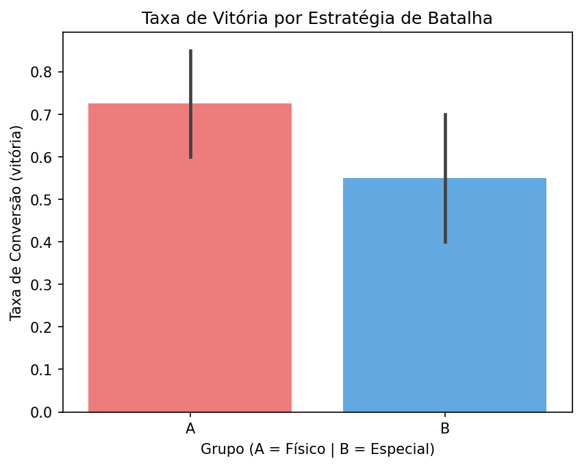

 # 🎮 Pokémon Battle Strategy — A/B Testing with Python

<p align="center">
  <a href="https://github.com/D-henrique/pokemon-ab-testing/blob/main/README.md">
    
  </a>
  <a href="https://github.com/D-henrique/pokemon-ab-testing/blob/main/README_pt.md">
    
  </a>
</p>

> *"Which battle strategy converts more trainers into Champions?"*  
> A statistically rigorous experiment applied to the Pokémon universe.

---

## 📌 Overview

This project applies **A/B Testing** to real Pokémon data retrieved from the [PokéAPI](https://pokeapi.co/), simulating a controlled experiment to compare two competing battle strategies:

- **Group A — Physical Strategy:** Fire-type Pokémon prioritizing `attack` and `speed`
- **Group B — Special Strategy:** Water-type Pokémon prioritizing `special_attack` and `hp`

The goal is to determine, with statistical rigor, which strategy yields the highest win rate — and whether that difference is statistically significant.

---

## 🧪 Hypotheses

| Hypothesis | Description |
|---|---|
| **H₀ (null)** | There is no significant difference in win rate between strategies A and B |
| **H₁ (alternative)** | One strategy yields a significantly higher win rate than the other |

Decision criterion: **p-value < 0.05** (significance level α = 5%)

---

## 🗂️ Project Structure

```
pokemon-ab-testing/
├── data/
│   ├── pokemon_stats.csv        # Raw data collected from PokéAPI
│   └── simulated_battles.csv    # Dataset with simulated battle outcomes
├── notebooks/
│   └── analysis.ipynb           # Exploratory analysis and visualizations
├── src/
│   ├── fetch_data.py            # Data collection via PokéAPI
│   ├── simulate.py              # Battle simulation engine
│   └── stats.py                 # Statistical testing and visualization
├── outputs/
│   └── ab_test_result.png       # Final test result chart
├── requirements.txt
└── README.md
```

---

## ⚙️ Methodology

### 1. Data Collection
Real base stats (`attack`, `special_attack`, `speed`, `hp`) collected for 40 Pokémon per type from the PokéAPI.

### 2. Experiment Simulation
Each Pokémon is assigned a `power_score` based on its group strategy:

```
Group A: power_score = attack × 0.6 + speed × 0.4
Group B: power_score = special_attack × 0.6 + hp × 0.4
```

Battle outcomes are simulated using `numpy.random.binomial`, with the normalized `power_score` as the win probability — ensuring full **reproducibility** via `seed=42`.

### 3. Statistical Test
A **Welch's t-test** (`scipy.stats.ttest_ind`) is applied to compare win rate distributions between groups A and B.

---

## 📊 Results



| Metric | Group A (Physical) | Group B (Special) |
|---|---|---|
| Win Rate | — | — |
| T-statistic | — | — |
| p-value | — | — |

> Values are generated at runtime. Run the project locally to see the full results.

---

## 🚀 Getting Started

**Requirements:** Python 3.9+

```bash
# Clone the repository
git clone https://github.com/d-henrique/pokemon-ab-testing.git
cd pokemon-ab-testing

# Create and activate virtual environment
python -m venv venv
source venv/bin/activate  # Windows: venv\Scripts\activate

# Install dependencies
pip install -r requirements.txt

# Run in order
python src/fetch_data.py    # 1. Fetch real data from PokéAPI
python src/simulate.py      # 2. Simulate battle outcomes
python src/stats.py         # 3. Run statistical test and generate chart
```

---

## 🛠️ Tech Stack


| Library | Purpose |
|---|---|
| `pandas` | Data manipulation and structuring |
| `numpy` | Probabilistic simulation with controlled seed |
| `scipy.stats` | Welch's t-test (ttest_ind) |
| `matplotlib` / `seaborn` | Result visualization |
| `requests` | PokéAPI REST consumption |

---

## 📚 Key Concepts

- Experimental design (control vs. variation group assignment)
- Monte Carlo simulation with reproducible seed
- Statistical inference (t-test, p-value, significance threshold)
- REST API consumption and nested JSON parsing
- Experimental result visualization

---

## 👤 Author

**Douglas Moreira**  
Data Analyst | MSc Candidate in Political Science (PPGCP/UFPA)  
[](https://linkedin.com/in/douglas-moreira-503164bb/)
[](https://github.com/d-henrique)

